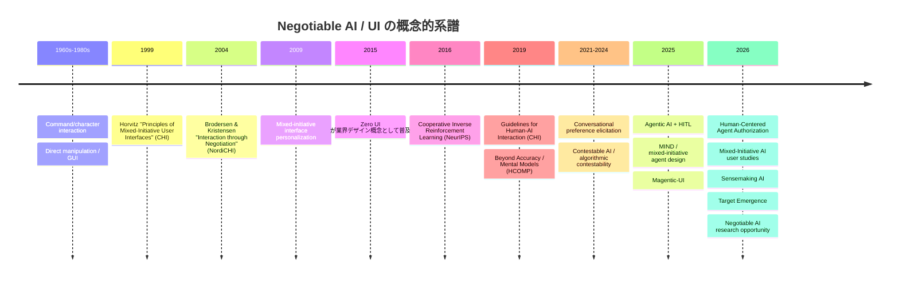
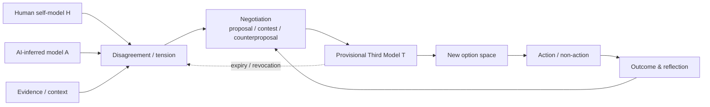

# Negotiable AI / Negotiable UI：既存研究・実装・制度の包括的サーベイと研究ギャップ

## エグゼクティブサマリ

### 結論

本調査の最も重要な結論は、**「Negotiable AI / Negotiable UI」という名称の確立した研究領域は、2026年8月9日時点ではまだ形成されていない一方、その構成要素はHCI、mixed-initiative interaction、contestable AI、human-AI teaming、conversational preference elicitation、adjustable autonomy、agent authorization、sensemaking、value alignment、human-in-the-loop agentsなどに分散して、かなり成熟している**ということである。

直接的な先行概念として特に重要なのは、Brodersen & Kristensen がNordiCHI 2004で提案した **“Interaction through Negotiation”** である。同論文は negotiation を ubiquitous/pervasive computing における一般的なHCIパラダイムとして提示しており、「交渉をインタラクション原理にする」という意味では、本構想の明確な歴史的先駆と位置づけられる。citeturn21search0turn21search7

しかし、現在のAIエージェント実装の主流はそこまで到達していない。OpenAI Agents SDK は高リスクtool callを人間がapprove/rejectするHITL、LangChain/LangGraphはapprove/edit/reject/respond、Claude Codeはpermission modeやPlan/Manual/automatic edit、GitHub Copilot cloud agentは自律的に作業した後にdiffをレビュー・反復する仕組みを備えている。これらは**「AIの行動を止める・修正する」Operational Negotiability**としては強いが、AIがユーザーについて形成した解釈、AIの断定権、目的関数、あるいは「私は何者か」という自己モデルを交渉する仕組みまでは一般化されていない。citeturn18search0turn18search3turn18search9turn18search14

現時点で最もNegotiable AIに近い実装の一つはMicrosoft ResearchのOSS研究プロトタイプ **Magentic-UI** である。ユーザーは実行前にagentのplanを編集し、実行中にも割り込み、ブラウザを直接奪取し、不可逆操作の承認ポリシーを変更し、過去のplanを保存・修正できる。すなわち、単なるAccept/Rejectより明確に **co-planning / co-tasking / action guards / plan learning** へ進んでいる。とはいえ、その主な交渉対象は依然として「タスクをどう遂行するか」であり、**AIの認識論的権限やユーザーの自己像そのものを交渉対象にするところまでは達していない**。citeturn20view3

理論面では、HorvitzのCHI 1999 **mixed-initiative UI** が「直接操作か自動化か」という二項対立を超え、両者を組み合わせる設計原則を示した。citeturn20view1 さらにNeurIPS 2016の **Cooperative Inverse Reinforcement Learning（CIRL）** は、AIが人間のreward functionを最初から知らないという形式化を導入した。ただしCIRLでは人間側のrewardは潜在的には既に存在しており、AIはそれを学習する。したがって、「目的そのものが人間とAIの相互作用から生成される」というNegotiable AIとは重要な違いがある。citeturn13search6

この違いを埋める最近の理論として重要なのが、2026年の **target emergence** と **Sensemaking AI** である。Fouratiらの target emergence は、ある活動では評価対象・目的が事前に完全には定まらず、候補・説明・比較との相互作用を通じて初めて明確になると論じる。citeturn19search0turn19search6 ComesのSensemaking AIは、AIを単なる最適化器ではなく、人間とのネットワーク内で意味形成を支援する存在として位置づける。citeturn19search1 この二つは、ユーザーが述べる「AIが考えた自分」と「自分がメタ認知する自分」のどちらでもない**第三の像・第三の選択肢**を理論化するうえで特に重要である。

したがって本報告では、Negotiable AI/UIを次のように操作的に定義する。

> **Negotiable AI / UIとは、人間とAIが、個々の行動だけでなく、権限、解釈、情報境界、介入タイミング、表現方法、目的、場合によっては自己モデルまでを、提案・異議・反提案・保留・撤回・再交渉によって共同で更新し、その暫定合意を実行可能かつ撤回可能なシステム状態として保持するHuman–AI Interaction paradigmである。**

この定義で重要なのは、**Negotiable ≠ Conversational、Negotiable ≠ Customizable、Negotiable ≠ Human-in-the-loop、Negotiable ≠ Contestable、Negotiable ≠ Autonomous** という点である。これらはすべて必要になり得る構成要素だが、十分条件ではない。

また、本サーベイで確認した主要一次文献・公式資料の範囲では、**`Claim-Capped AI` および `Co-emergent Self` は定着した学術用語としては確認できなかった**。したがって本稿では、前者を「AIが許される主張強度を制約する設計概念」、後者を「人間の自己申告とAI推論のどちらにも還元されず、相互作用の中で暫定的に成立する自己モデル」という**working concept**として扱う。一方、mixed-initiative、contestability、Interaction through Negotiation、target emergence、Sensemaking AIは既存文献上確認できる概念である。citeturn20view1turn21search0turn19search0turn19search1

**調査上の「無指定」事項**は以下のように処理した。文献対象期間は無指定のためHCI史的源流から2026年8月9日までを対象とした。地域は無指定のため国際研究に加え日本・EU・米国/OECDを含めた。CUIの語義は無指定だが、提示された歴史順序から本稿では主として**Command/Character-oriented UI**を意味すると解釈し、現在「CUI」と呼ばれることのあるConversational UIとは区別する。systematic reviewのデータベース・包含除外プロトコルも無指定であるため、本稿はPRISMA型systematic reviewではなく、**一次資料優先のscoping/critical survey**として位置づける。

## 定義・歴史的系譜・概念フレーム

提示された

> CUI → GUI → Zero UI → Accept型 → Autonomous → Negotiable

という系列は、厳密な技術史として一世代ずつ置換されたものではなく、**「誰が可能性空間を定義し、誰がいつ決定できるか」というagency allocationの分析モデル**として捉えると非常に有効である。GUIの発達はdirect manipulationによって人間の明示的操作能力を拡大し、その後mixed-initiative研究はdirect manipulationとautomationを二者択一ではなく結合する問題として扱った。citeturn1search0turn20view1 Zero UIは学術的な明確な世代区分というより、FjordのAndy Goodmanらが2015年前後に広めた「screenを中心にしない、voice・gesture・sensor・contextによるinteraction」という業界デザイン概念として扱うのが正確である。citeturn15search4

### インタラクション段階の比較

| 段階 | 主要なinteraction | 選択肢を主に作る主体 | 人間の主権 | AI/System側の主権 | Negotiability |
|---|---|---|---|---|---|
| CUI / Command | 人間が命令を記述 | 人間＋システム言語設計者 | 手段を明示 | コマンドを実行 | 低 |
| GUI / Direct Manipulation | 見える対象を選択・操作 | UI designer | 選択・操作 | 選択肢空間を固定 | 低 |
| Zero UI | voice/context/sensorによる暗黙的interaction | designer＋推論系 | 明示操作を減らせる | 意図を推定 | 低〜中 |
| **Accept型 AI/UI** | AIが案を作り、人間が承認・拒否 | 主にAI | veto | proposal power | 中 |
| Autonomous AI | 人間がgoalを与えAIがplan/action | 人間＋AI | goal/policy設定 | planning/execution | 中 |
| **Negotiable AI/UI** | 提案・異議・反提案・再定義 | **人間とAI** | veto＋counterproposal＋reframing | proposal＋challenge＋reframing | **高** |

ここで「Accept型」は既存研究分野の正式名称ではなく、本稿の分析ラベルである。現在のagentic systemsに広く見られる「AIがactionを提案し、ユーザーがapprove/rejectする」interactionを指している。OpenAI Agents SDKやLangChainのHITLはまさにこの構造を明示的なAPI primitiveとして実装している。citeturn18search0turn18search3

重要なのは、**RejectできることとNegotiableであることは同じではない**ことである。

```text
Accept型
AI: Aを実行します
Human: Accept / Reject

Editable型
AI: Aを実行します
Human: A' に修正

Negotiable型
AI: 目的XならAがよい
Human: そもそもXを優先したくない
AI: ではYを優先するとB。ただし制約Zと衝突する
Human: Zはこの場面では緩めてよいが、保存はしない
AI: その条件なら、A/BにはなかったCを暫定案にできる
```

最後のケースでは、単に**action**ではなく、goal、constraint、interpretation、permission、option spaceが交渉されている。

### 概念史タイムライン



これは「古いUIが消えて次のUIに置き換わった」というタイムラインではない。むしろ、direct manipulation、automation、mixed initiative、contestability、agent autonomyが累積し、2025–2026年にagentic AIによって**“誰が何を決めるか”そのものがUI問題に戻ってきた**と読むべきである。Horvitzは1999年にautomationとdirect manipulationの結合を問題化し、Brodersen & Kristensenは2004年にnegotiationそのものをHCI paradigmとして提示した。2019年のHuman-AI Interaction Guidelinesは18の一般的指針を49人の実務家・20製品で検証し、2025–2026年にはagent authorizationやmixed-initiative agent interactionが再び主要課題になっている。citeturn20view1turn21search0turn20view2turn14search3turn19search2

### 六つの交渉対象

以下は既存研究を統合した**本サーベイの提案taxonomy**である。特定の一論文がこの6分類を提示しているわけではない。

| 交渉対象 | 問い | 典型例 | 主な関連研究 |
|---|---|---|---|
| **Agency** | AIは何を自律実行してよいか | 「メールは下書きまで。送信は確認」 | adjustable autonomy, HITL, agent authorization |
| **Epistemic authority** | AIは何を、どの強さで「知っている」と言ってよいか | 「stressとは断定せず unusual pattern と表現」 | XAI, contestability, mental models |
| **Privacy** | 何を読める・保存できる・共有できるか | 「calendarは参照可、健康情報は保存不可」 | privacy, consent, authorization |
| **Initiative** | AIからいつ割り込んでよいか | 「緊急時だけproactiveに通知」 | mixed initiative, attentive UI |
| **Representation** | どう表現・抽象化・不確実性提示するか | 「数値ではなく範囲で提示」 | HAI guidelines, XAI, CRS |
| **Objective** | 何を最適化するか | 「速さより納得感を優先」 | preference elicitation, CIRL, target emergence, sensemaking |

Horvitzのmixed-initiative研究はinitiativeの分配と自動化/直接操作の結合に直接関係する。citeturn20view1 CIRLはAIが人間のreward functionに不確実性を持つことを形式化しておりobjective negotiationの理論的祖先だが、rewardそのものの共同生成とは異なる。citeturn13search6 2026年のHuman-Centered Agent Authorizationはgranting・managing・auditing permissionsをユーザー中心に再設計しようとしており、agency/privacyに近い。citeturn19search2turn19search5

### 三層のNegotiability

ユーザーが提示した operational / epistemic / ontological の3層は、既存分野を整理する上でかなり有効である。ただしこれも現時点では**統合フレーム**であって、確立した標準分類ではない。

| 層 | 交渉するもの | 例 | 現在の研究成熟度 |
|---|---|---|---|
| **Operational** | action、plan、permission、timing | 「この支払いだけ確認して」 | 高 |
| **Epistemic** | inference、confidence、claim、evidence | 「疲れている、ではなく睡眠が通常より短いと言って」 | 中〜低 |
| **Ontological** | category、identity、goal-space、possible self | 「研究者か起業家か、ではなく第三の役割を作る」 | 非常に低 |

現在のagent systemsはOperational layerが急速に発達している一方、Contestable AIはEpistemic layerへの橋を架け始めている。Ontological layerについては、target emergenceとSensemaking AIが理論的に近づいているが、**自己モデルをversioned・contestable・revocableなinteraction objectとして実装する研究はほぼ空白**というのが本調査の判断である。citeturn14search31turn19search0turn19search1

「第三の像」は、次のように形式化するとよい。

\[
H_t = \text{human-articulated self model}
\]

\[
A_t = \text{AI-inferred self model}
\]

\[
T_t = \mathcal{N}(H_t,A_t,E_t,C_t)
\]

ここで \(E_t\) はevidence、\(C_t\) はcontext、\(\mathcal{N}\) はnegotiation processである。重要なのは、

\[
T_t \neq \alpha H_t +(1-\alpha)A_t
\]

という点である。第三の像は妥協点や平均値ではなく、**元の双方のrepresentationにはなかった新しいcategory・goal・optionを生成し得る**。



Target emergenceは、まさに「評価targetがinteraction以前に完全に定まっていない」タスクの存在を論じており、この第三の選択肢の理論的根拠として重要である。ただし同論文の中心は自己同一性ではなくtask targetであるため、**target emergence → co-emergent self** は今後検証すべき拡張であって、既に実証された帰結ではない。citeturn19search0turn19search6

## 文献レビュー

Negotiable AIを単一キーワードで探すより、以下の研究群を「何を交渉可能にしたか」で読む方が研究地図として正確である。

### 主要文献の位置づけ

| 年 | 文献・系統 | Venue | Negotiable AIへの意味 | 残る限界 |
|---|---|---|---|---|
| 1999 | Horvitz, *Principles of Mixed-Initiative User Interfaces* | CHI | system/user initiativeを二者択一でなく結合 | objective/self-modelは所与 |
| 2004 | Brodersen & Kristensen, *Interaction through Negotiation* | NordiCHI | negotiationをHCI paradigmとして明示 | pre-LLM、AI self-modelなし |
| 2009 | Mixed-Initiative Interface Personalization | AI Magazine | adaptationをsystemだけでなくuser involvementへ | personalization中心 |
| 2014 | Choice-based Preference Elicitation | CHI系 | algorithmic recommendation＋user-controlled interaction | latent preference前提が強い |
| 2016 | Hadfield-Menell et al., CIRL | NeurIPS | human rewardについてAIがuncertain | reward自体は既存 |
| 2019 | Amershi et al., HAI Guidelines | CHI | AI挙動の18ガイドライン | negotiated contractではない |
| 2019 | Bansal et al., *Beyond Accuracy* | HCOMP | team performanceにはAI accuracy以上が必要 | interaction contractまでは扱わない |
| 2021 | Conversational Recommender Systems survey | ACM CSUR | preferenceを対話的に逐次elicitation | preference discovery中心 |
| 2024 | *Understanding Contestability on the Margins* | CHI | decision subjectによるcontest | 主に事後的contest |
| 2024–26 | Contestability Along AI Value Chains | CSCW | contestabilityをAI lifecycle全体へ拡張 | bilateral negotiationとは異なる |
| 2025 | MIND | IUI | agent automationとdirect manipulationを再接続 | workshop agenda段階 |
| 2025 | Magentic-UI | MSR/OSS | co-plan、intervene、approval policy | operational中心 |
| 2026 | Mixed-Initiative AI perception | IUI | assistance timing/mode自体がUXに影響 | self/objective layerは限定 |
| 2026 | Human-Centered Agent Authorization | CHI EA | permissionをgrant/manage/auditする設計 | permission中心 |
| 2026 | Sensemaking AI | EPJ Data Science | meaning formationをhuman-AI network問題として扱う |具体的UI primitive未確立 |
| 2026 | Target Emergence | arXiv | goal/targetがinteraction中に成立し得る | 理論中心、UI実装が未成熟 |

Horvitzの1999年論文は、AIが何でも自律的に行う方向と、人間がすべてdirect manipulationする方向の間にmixed initiativeを置いた点で、Negotiable AIの重要な祖先である。Lookoutなどではユーザーの意図・注意・介入タイミングを推論する方向も探索されていた。citeturn20view1

Brodersen & Kristensenの2004年論文はより直接的で、**“Interaction through Negotiation”を一般的HCI paradigmとして明示している**。ただし、対象はubiquitous/pervasive environment内の人間・場所・artifact間の関係であり、現代のfoundation-model agentが持つ継続的ユーザーモデル、自然言語的反提案、tool execution、生成的option-spaceなどは当然対象外である。ここに約20年後の技術による再定式化余地がある。citeturn21search0turn21search7

**Mixed-initiative と Negotiable AIの差。** Mixed initiativeは主に「どちらがいつinitiativeを取るか」を問う。一方Negotiable AIでは、initiativeの分配自体を含め、**何が許されるか、何を目標にするか、何を真実として扱うか**も交渉対象になる。2026年IUI研究でも、mixed-initiative AIではassistanceの内容だけでなく、その提供modeそのものがユーザー態度に影響し、ユーザーがbuttonでいつ・どの程度支援を求めるかを決める形式とsystem-initiated形式の差が研究対象になっている。citeturn14search3turn14search18

**Adjustable autonomy / controlとの差。** 2026年CHIではhuman-AI co-creativityのcontrolをautonomy、initiative、authorityなど複数次元で捉える動きが進んでおり、agent designが単一の「自律度slider」では不十分であることを示している。citeturn12search2 Negotiable AIはこの多次元controlを、設定値ではなく**interaction中に再交渉可能な契約**として扱うところに新規性を置ける。

**Contestable AIとの差。** ContestabilityはNegotiable AIの必須要素である。CHI 2024の研究はアルゴリズム判断を受ける人々にとってcontestabilityが重要なresponsible AI問題であることを扱い、CSCWではcontestabilityをAI value chain全体へ広げる研究コミュニティが形成されている。2026年にも“Humans-in-the-Contestability-Loop”が提案されている。citeturn14search31turn14search2turn14search27

ただし典型的contestabilityは、

\[
\text{AI decision} \rightarrow \text{explanation} \rightarrow \text{contest}
\]

という構造になりやすい。

Negotiabilityは、

\[
\text{problem framing}
\leftrightarrow
\text{evidence}
\leftrightarrow
\text{objective}
\leftrightarrow
\text{proposal}
\leftrightarrow
\text{counterproposal}
\]

を**decision以前から相互更新する**。したがって、

> **Contestability is the right to challenge an AI decision.  
> Negotiability is the capacity to reshape the conditions under which a decision becomes possible.**

という区別が研究上有用である。

**Preference elicitationとの境界。** Conversational recommender systemsは対話を通じてユーザーのpreferencesを逐次取得・精緻化する研究を蓄積している。JannachらのsurveyはCRSを複数軸で整理し、user preferenceのinteractive elicitationを主要課題の一つとして扱う。citeturn13search0turn13search4 またchoice-based preference elicitationにはalgorithmic recommendationとuser-controlled interactive inputを組み合わせる研究がある。citeturn13search7

しかし多くの場合、暗黙のモデルは、

\[
\exists P^* \quad \text{and system tries to estimate }P^*
\]

すなわち「真のpreferenceが既にあり、それをうまく引き出す」である。

Negotiable AIが狙う強いケースは、

\[
P^* \text{ may not exist before interaction}
\]

であり、

\[
P_{t+1}=f(P_t,\text{AI alternatives},\text{reflection},\text{context})
\]

という**preference construction / target emergence**である。この区別こそ、推薦研究からNegotiable AIを独立した問題として立ち上げる際の重要な理論ポイントになる。target emergenceは、この方向にかなり近い理論的基盤を与える。citeturn19search0turn19search6

**CIRLとの境界。** NeurIPS 2016のCIRLではhumanとrobotが協力し、両者のrewardはhuman reward functionに依存するが、robotはそのreward functionを初期には知らない。そのためactive teaching、active learning、communicationが合理的になる。citeturn13search6 これはNegotiable AIに非常に重要だが、

> 「AIがまだ人間の価値を知らない」

と

> 「人間自身にもinteraction前には価値・目標が完全には定まっていない」

は別問題である。

後者はCIRLよりtarget emergence / sensemakingに近い。

**Mental modelsとtrust calibration。** HCOMP 2019のBansalらはhuman-AI team performanceをAI accuracyだけで評価するのでは不十分であり、人間がAIのcapabilityをどう理解しているかというmental modelがteam performanceに関係することを論じた。citeturn14search0 この系譜から見るとNegotiable AIの評価対象も単純な「trust上昇」であってはならない。AIを信じさせるほどよいのではなく、**いつ信頼し、いつ異議を唱え、いつAIに委譲すべきかを適切に理解できること**が重要になる。

2019年のMicrosoftのHuman-AI Interaction Guidelinesも、18の一般的指針を49人のAIデザイン実務家・20のAI製品を使って検証しており、現在のHuman-AI UXに至る重要な基盤である。citeturn20view2 しかしguidelineはdesign-timeにシステム設計者が良い挙動を決める枠組みであり、**ユーザーとAIがrun-timeにその挙動規則を共同編集する**Negotiable AIとは一段異なる。

**Sensemakingと第三の像。** Sensemaking AIは2026年のpeer-reviewed研究として、複雑で不確実な状況におけるhuman-AI networkの意味形成を研究・設計課題として提示している。citeturn19search1 ここから導かれる強い研究仮説は、

> AIは「既にある自己」を正しく推定するだけではなく、  
> 自己理解を揺さぶるalternative representationを提示し、  
> 人間とのinteractionによって新しい暫定的自己理解を成立させ得る

というものである。

ただし、これを**Co-emergent Self**としてデータモデル化・UI化・評価した確立研究は本調査範囲では確認できなかった。この点はむしろ大きなresearch gapである。

なおHCOMP自体も2026年からACMの **Human-AI Complementarity and Alignment** を中核テーマとする会議へ移行しており、人間を単なるannotation sourceではなくAIとの相補的主体として捉える研究潮流は明確に強まっている。citeturn14search26

## 実装事例・プロダクト・API・OSS

現行システムを「Negotiabilityの成熟度」で見ると、かなり明瞭な階層がある。

| システム | 種別 | Negotiation primitive | O | E | Ont | 評価 |
|---|---|---|---:|---:|---:|---|
| OpenAI Agents SDK | SDK/API | approve / reject / tool approval policy | ●●● | ○ | ○ | action gateとして強い |
| LangChain / LangGraph | OSS framework | approve / edit / reject / respond | ●●● | ● | ○ | counterproposalへの橋がある |
| Claude Code | Product/agent | permission rules、Plan、Manual、auto edit | ●●● | ● | ○ | adjustable autonomyが実用化 |
| GitHub Copilot cloud agent | Product/agent | autonomous work→diff review→iterate→PR | ●●● | ● | ○ | delegated autonomy＋review |
| Magentic-UI | OSS research prototype | co-plan、co-task、action guard、plan learning | ●●● | ●● | ○ | 現時点で最も近い |
| Conversational recommenders | Research/product class | preference elicitation / critique | ●● | ●● | ○〜● | preference negotiationに近い |
| Human-Centered Agent Authorization | Design/research | grant/manage/audit permissions | ●●● | ● | ○ | governance層を補完 |
| **Full Negotiable AI** | 未確立 | goal/claim/self-modelまで契約化 | ●●● | ●●● | ●●● | **研究空白** |

O = Operational、E = Epistemic、Ont = Ontological。本表の●は本報告による分析評価であり、各製品の公式自己評価ではない。

**OpenAI Agents SDK。** 公式HITL仕様では、sensitive tool callを実行前にpauseし、人間がapproveまたはrejectする。run stateを保存して承認後に再開することもできる。MCP toolについても`require_approval`によりapproval policyを設定できる。citeturn18search0turn18search4 これはagentic autonomyを安全に使う重要なprimitiveだが、人間の返答空間は基本的に「実行してよいか」というoperational decisionである。

**LangChain / LangGraph。** Negotiable AIへの距離という意味ではさらに興味深い。HITL middlewareはtool callを止め、人間が **approve、edit、reject、respond** を選択できる。特にreject時にfeedbackをagentへ返し、別の安全な手段を検討させる設計が可能である。citeturn18search3turn18search7turn18search15 これは単なるvetoから、

\[
proposal \rightarrow counterproposal \rightarrow replanning
\]

への最小primitiveを既に備えている。ただし「なぜその行動を提案したのか」というpremiseやobjectiveを構造化して交渉するprotocolは標準化されていない。

**Claude Code。** Claude Codeにはtool permissionsを閲覧・管理する`/permissions`があり、日本語公式ドキュメントも提供されている。citeturn18search9 IDE integrationではManual、Plan、automatic editingなど異なるinteraction modeを持ち、Plan modeでは実行前のplanに人間がfeedbackを与えられる。citeturn18search33 Accept Editsでは一定のfilesystem操作を自動承認するなど、継続的なpermission configurationもある。citeturn18search17 これは「毎回Accept」を超えて**policy-level adjustable autonomy**に進んでいる。

**GitHub Copilot cloud agent。** Copilotはrepositoryを調査し、implementation planを作り、branch上で変更し、人間がdiffを確認・iterateしてPRを作成できる。citeturn18search14 Business/Enterpriseではagentの利用自体をorganization/repository単位で制御するadministrative policyもある。citeturn18search22turn18search38 ここでは人間はmicro-operationから退き、より上位のreview/authorizationに移る。これは「GUI操作→AI action→人間の監督」へのagency shiftの好例である。

**Magentic-UI。** 最重要実装例である。Microsoft Researchはこれをfull autonomyを目指すweb agentとは異なり、transparent and controllableなhuman-centered research prototypeとして公開している。citeturn20view3

実装primitiveは以下のようにNegotiable AIへかなり近い。

- 実行前のplanを人間がadd/delete/edit/regenerateできる **co-planning**
- 実行中に停止し、自然言語feedbackまたは直接browser controlを行う **co-tasking**
- 不可逆actionに対する **action guards**
- approval頻度自体のconfiguration
- 過去の成功planを保存し、後でhuman/agentが修正して再利用する **plan learning**

これらはすべて公式資料で明示されている。citeturn20view3

特に重要なのは、Magentic-UIが「AIのplanをAcceptする」だけでなく、

> **planを共同編集する**

ところまで進んでいる点である。

一方、

```text
Plan
  ↓
Action
```

を共同編集することと、

```text
What counts as success?
What evidence may you use?
How strongly may you characterize me?
Who am I in this context?
What alternatives should exist?
```

を共同編集することの間にはまだ大きな距離がある。

したがってMagentic-UIは、

> **Operational Negotiable Agentの強いprototype**

ではあるが、

> **Epistemically / Ontologically Negotiable AI**

とはまだ呼びにくい。

**Human-Centered Agent Authorization。** CHI 2026のcommercial AI agents landscape analysisは、agent permissionsを単なるsecurity settingではなく、ユーザーが理解しながらgrant・manage・auditできるHuman-Centered Agent Authorizationとして設計すべきだと提案している。citeturn19search2turn19search5 これはNegotiable AIのcontract architectureに直接接続可能である。

ここから見える実装上の空白は、**現在の「permission」がboolean/ACLとして実装されているのに対し、人間の意向は条件文である**という問題である。

```text
現行:
send_email = ask
calendar_read = allow

Negotiable:
send_email:
  allow_if:
    - recipient in team
    - no financial commitment
  ask_if:
    - external recipient
    - attachment contains personal data
  deny_if:
    - health information
  rationale:
    - "I want drafts automated but social commitments remain mine."
  expires:
    - project_end
```

つまり次世代のpermission systemはACLというより**negotiated policy language**になる可能性が高い。

### Negotiated Interaction ContractのERモデル

```merm
